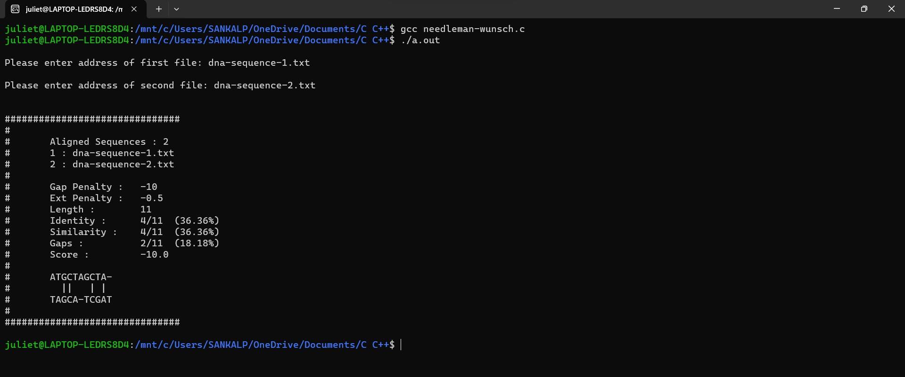

# Needleman-Wunsch Algorithm Implementation in C

## Overview
This C program demonstrates the implementation of the Needleman-Wunsch algorithm, a dynamic programming algorithm used for global sequence alignment. It is widely used in bioinformatics to compare protein or nucleotide sequences.

## Features
- **Global Sequence Alignment**: Computes the optimal alignment of two input sequences.
- **Customizable Scoring**: Allows customization of match, mismatch, and gap penalties.
- **Output Alignment**: Prints the aligned sequences along with their alignment score.

## Requirements
- C compiler (e.g., gcc)
- Standard C libraries

## Usage
1. Compile the program using your C compiler:
   ```
   gcc needleman-wunsch.c -o needleman_wunsch
   ```
2. Run the executable:
   ```
   ./needleman_wunsch
   ```
A sample output would look something like this



## Algorithm Explanation
The Needleman-Wunsch algorithm works by constructing a matrix to represent all possible alignments between two sequences. It then calculates a score for each alignment based on a similarity matrix and a gap penalty. Finally, it traces back through the matrix to determine the optimal alignment.

## Important
1. The input txt files must contain the dna sequence in a single line.
2. Maximum length of input dna sequence has been set to 500 bps. In case the dna is bigger, change the MAX_LENGTH accordingly.
3. The code is designed keeping in mind DNA sequences containing A, T, G and C only.
4. The max function defined is biased to prefer D > L > T in case of equality.
5. The biased max leads to one particular alignment only in case of multiple possible alignments.
6. The match-mismatch value while forming the scoring matrix are according to the EDNAFULL matrix.
7. The -gapopen and -gapextend penalties adhere to EMBOSS:6.6.0.0
8. The program does not consider -endopen and -endextend penalties while calculating score.

Two sample DNA sequences (length = 10bps each) are also provided. 
[dna-sequence-1](dna-sequence-1.txt) and [dna-sequence-2](dna-sequence-2.txt)

Code was run/tested in Ubuntu terminal with gcc version 11.4.0


## File Structure
- `needleman-wunsch.c`: The main C file containing the implementation of the Needleman-Wunsch algorithm.
- `README.md`: This README file providing information about the program.
- `important.txt`: This README file providing information about the program.

## License
This project is licensed under the [MIT License](LICENSE).

## Need Help With
- [Understanding the Algorithm](https://medium.com/@hasini.dbv/pairwise-sequence-alignment-global-and-local-alignments-5ebacf83c752)
- [EMBOSS Needle Documentation](https://www.bioinformatics.nl/cgi-bin/emboss/help/needle)